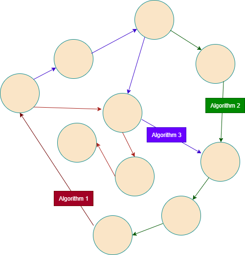
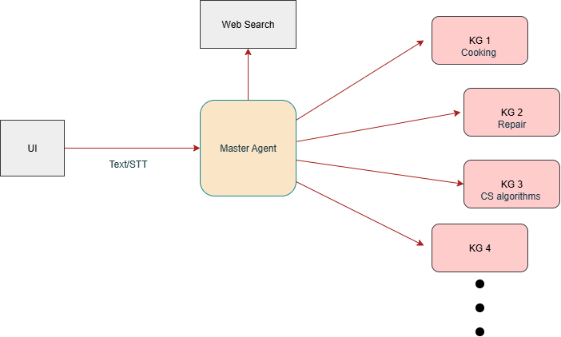

Here’s a clean, **complete** `README.md` you can drop in the repo.
I kept your original narrative (with the same image refs) and added a thorough tour of the codebase + step-by-step run instructions.

---

# GRACE: Graph-Based Reasoning Across Computational Environments 🧠

## 👥 Authors

Ahmad Abbas • Nour Fakih • Tamara Fakih

## 🌍 Overview

**GRACE** (Graph Reasoning & Algorithm Composition Engine) is a **multi-domain reasoning assistant** that organizes procedural knowledge — such as *recipes*, *repair guides*, or *algorithms* — into **knowledge graphs**. It uses those graphs to **retrieve**, **compose**, and **explain** step-by-step solutions.

> Think of GRACE as a *knowledge graph for doing things* — not just answering questions, but showing how the answer is built.

## Motivation & Origin 💡

We began with a simple hunch: **algorithms across different domains are connected**. Their ideas often influence, reuse, or compose one another. A strategy in one setting (e.g., divide-and-conquer) can inspire a plan in another (e.g., staging tasks in a kitchen). We wanted to capture these interdependencies explicitly—to see how one procedure's logic can enable or inform another—and the most natural representation was a graph.



### Graph Structure 🕸️

* **Nodes**: meaningful units (steps, tools, resources, variables, functions)
* **Edges**: relationships (depends-on, uses, produces, precondition-of, part-of, similar-to)
* **Algorithms** emerge as paths/subgraphs; cross-links reveal shared motifs and transferable reasoning.

## Why We Started with Everyday Domains 🍳

We scoped this during a 12-hour hackathon, so we reframed “algorithm” as **any everyday procedure** and started with **cooking**:

* A **recipe is an algorithm**: inputs (ingredients), constraints (diet/time), steps (method), output (dish).
* The domain offers clear relationships: shared ingredients, substitutions, techniques, cuisines.
* Edges like `contains`, `substitutes-for`, `similar-to`, `belongs-to`, `requires-tool` make the structure tangible.
* The result is explainable and intuitive for demo and UX.

## GRACE Capabilities 🚀

* **🔍 Retrieve** relevant neighborhoods for a user’s query (e.g., “mushroom + chicken”)
* **💡 Compose** new procedures by recombining compatible nodes/edges
* **📖 Explain** proposals by showing exact nodes/edges (e.g., shiitake → cremini via `substitutes-for`)

## Extending Beyond Cooking 🔧

We apply the same approach to **repair/maintenance** (apparel fixes, appliances, phones, hardware). Each guide is a procedure:

* **Inputs**: tools/materials
* **Constraints**: safety, prerequisites, device model
* **Steps**: ordered instructions
* **Output**: repaired item

This yields parallel graphs where nodes/edges mirror cooking, enabling transfer of procedural motifs (safety checks ↔ preconditions, tool usage ↔ resource dependencies, step ordering ↔ control flow).

## Roadmap 🗺️

**Short term**: build strong graph backbones for cooking/repair; surface explainable traversals in the UI
**Medium term**: scale to CS algorithms; link shared strategies (greedy/DP/recursion); compare trade-offs
**Long term**: cross-domain library of algorithmic motifs; reuse motifs to compose new solutions; transparent “why-path” justifications

## Future Architecture: End-to-End Problem Solver 🤖

We envision GRACE as an agentic orchestrator over retrieval + planning + explanation:

```
User Query
  │
  ▼
GRACE Orchestrator
  │
  ├──> Graph Retriever (multi-hop, subgraphs)
  ├──> Context Composer (entities + community summaries)
  └──> LLM Planner (prompt-based reasoning)
  │
  ▼
Structured Answer (step-by-step + graph citations)
```



---

# Repository Tour

> KGs are *built artifacts*. You ingest text into HiRAG → it writes caches under `kgs/<graph>/<mode>/.hi_cache/` and an `index.json` for the UI.

```
GRACE/
├─ books/                       # Source texts for ingestion
│  ├─ food.txt
│  └─ books_3a_janab/...
│
├─ rag/                         # RAG toolkit (thin wrapper over HiRAG)
│  ├─ __init__.py               # RAG class: build/retrieve/answer/history/dump_index
│  ├─ config.py|config.yaml     # Resolves paths, embeddings, HiRAG knobs
│  ├─ embeddings.py             # E5 or OpenAI embedding helpers
│  ├─ rag_examples.py           # Demo scripts (context prints + tiny chatbot loop)
│  ├─ runners/
│  │  ├─ base.py                # Abstract runner interface
│  │  └─ hirag.py               # HiRAGRunner: insert/query/answer + CSV parsing + dump_index
│  └─ vis/
│     └─ index_utils.py         # Builds UI graph payload from .hi_cache (GraphML + chunk store)
│
├─ server/                      # Flask backend (REST API over rag.RAG)
│  ├─ app.py                    # Endpoints: /kgs, /data, /retrieve, /answer, /history, /.../stream
│  ├─ agent.py                  # LLM summarizer + KG ranking (auto-route) cached in summary.txt
│  ├─ utils.py                  # KG discovery, registry, history IO, RAG instance cache
│  ├─ config.py|config.yaml     # Server settings (ports, CORS, summary model, top_k/m)
│
├─ kgx-ui/                      # Vite + React + TS graph explorer
│  ├─ src/
│  │  ├─ api.ts                 # Client for backend; payload normalizers
│  │  ├─ App.tsx                # Shell: loads KGs, chat + graph, overlays
│  │  ├─ overlay.ts             # Build highlight sets (hits + reasoning path)
│  │  ├─ components/
│  │  │  ├─ ChatDock.tsx        # Chat panel + send/replay; hooks graph highlights
│  │  │  ├─ GraphCanvas.tsx     # ForceGraph2D layout; levels, colors, labels
│  │  │  ├─ Legend.tsx          # Palette + path/bridge legend
│  │  │  └─ SideInfo.tsx        # Node/edge drawer (metadata + source chunks)
│  │  ├─ theme.css              # Layout + styling
│  │  └─ types.ts               # Shared UI types
│  ├─ index.html, vite.config.ts, package.json, ...
│
├─ tools/
│  └─ rebuild_kv.py             # (utility) regenerate KV stores if needed (optional)
│
├─ kgs/                         # (generated) graphs live here after build
│  └─ cooking_kg/
│     └─ hi/
│        ├─ .hi_cache/          # HiRAG caches (chunks, entities, graphml, reports)
│        ├─ index.json          # UI graph payload (built via dump_index)
│        └─ history/            # Saved contexts for queries
│
├─ requirements.txt
└─ README.md (this file)
```

### Data flow (end-to-end)

1. **Ingest** `books/*.txt` → `RAG.build_from_file(...)` (HiRAG inserts + clusters).
2. **Caches** written under `kgs/<graph>/<mode>/.hi_cache/` (chunks, entities, community reports, GraphML).
3. **Dump** `index.json` (via `rag.dump_index`) for the UI.
4. **Serve** via Flask (`server/app.py`) → `/kgs`, `/data/<kg>`, `/retrieve`, `/answer`.
5. **UI** (`kgx-ui`) fetches `/kgs` + `index.json`, renders graph, calls `/retrieve`/`/answer`.
6. Each query writes `history/<run_id>/<qid>/context.json` for replay + highlighting.

---

# Setup & Run

> Backend (Flask + HiRAG) is pure Python; Frontend is a Vite/React workspace.
> No `node_modules` or `.venv` are checked in, so each fresh clone restores them.

## 0) Prereqs

* **Python 3.10+**
* **Node 18+** (for the UI)
* **OpenAI API key** (default embedding is OpenAI; you can switch to local E5 in `rag/config.yaml`)

## 1) Backend setup

From repo root:

```bash
python -m venv .venv
# macOS/Linux
source .venv/bin/activate
# Windows (PowerShell)
# .venv\Scripts\Activate.ps1

pip install -r requirements.txt
```

Create a **`.env`** at the repo root (used by `rag/config.py`):

```env
OPENAI_API_KEY=sk-...
```

> Want to avoid OpenAI? Edit `rag/config.yaml`:
>
> ```yaml
> default_embedding:
>   class: e5
>   model: intfloat/multilingual-e5-base
> ```
>
> and install `sentence-transformers`.

## 2) Build a Knowledge Graph

Build from the supplied book(s) and dump the UI index:

```bash
# Option A: ingest one file
python -m rag.cli --book books/food.txt

# Option B: ingest every *.txt under books/
python -m rag.cli
```

This creates:

```
kgs/cooking_kg/hi/.hi_cache/*   # chunks, entities, community reports, GraphML
kgs/cooking_kg/hi/index.json    # UI payload
```

> **FYI on utilities:** There’s also a helper under `tools/rebuild_kv.py` you can run directly if you want to regenerate KV caches. The recommended canonical path remains `python -m rag.cli` (ingest + dump).

## 3) Launch the API

```bash
python -m server.app
# Binds to http://127.0.0.1:8000
```

**Smoke test:**

```bash
curl http://127.0.0.1:8000/kgs
curl -X POST http://127.0.0.1:8000/retrieve \
  -H "Content-Type: application/json" \
  -d '{"kg":"cooking_kg/hi","query":"Make jammy eggs"}'
```

## 4) Launch the UI

```bash
cd kgx-ui
npm install
npm run dev -- --host
# Visit the shown URL, e.g. http://127.0.0.1:5173
# The dropdown calls /kgs, so keep the backend running.
```

**Production build:**

```bash
npm run build
# (serve dist/ with your favorite static server or reverse-proxy to Flask)
```

---

# Backend: API Cheatsheet

* `GET /healthz` → `{status:"ok"}`
* `GET /kgs?refresh=1` → list discovered KGs (`kgs/<name>/<mode>/.hi_cache` present)
* `GET /kgs/<kg_id>/index.json` (alias `GET /data/<kg_id>`) → graph payload for UI
* `GET /data/<kg_id>/<qid>/context.json?run_id=...` → saved context record
* `POST /retrieve`
  Body: `{"kg":"cooking_kg/hi","query":"...", "top_k":8}`
  Returns context + node hits
* `POST /answer`
  Body: `{"kg":"cooking_kg/hi","query":"...","top_k":8,"model":"gpt-4o-mini"}`
  Returns `answer` **and** the same context payload
* **Auto-routing** (rank KGs via LLM summaries):

  * `POST /retrieve/auto` → `{kg_rankings, results:[{kg_id, payload}]}`
  * `POST /answer/auto` → idem + answers
* **Streaming** (SSE, one KG): `POST /answer/stream`
  Emits `context_progress`, an `answer` event (single chunk), and `done`.
* **History**:

  * `GET /history?run_id=...` → paginated items for a run
  * `GET /history?kg=cooking_kg/hi` → latest records across a KG
* **Summaries**:

  * `POST /summaries/refresh` `{kg_id, force?}` → rebuilds `summary.txt`

---

# Configuration

## RAG config (`rag/config.yaml`)

* `logs_path` / `cache_dir` → where KGs live. Default graph: `./kgs/cooking_kg`
* **Embeddings**: `default_embedding.class` = `openai` (default) or `e5`
* **HiRAG knobs**: chunk sizes, clustering algorithm (`leiden`), node2vec params, etc.

## Server config (`server/config.yaml`)

* `rag_config_path` → points to the RAG config above
* `graphs_root` → where to scan for KGs (`../rag/kgs` by default)
* `default_top_k` / `default_top_m` (for auto-routing fan-out)
* `summary.model` / `prompt` (used to summarize KGs for ranking)
* `app.cors_origins` → CORS origins (default `["*"]`)

---

# How things are stitched together

* **Ingestion** (`rag/`):

  * `RAG.build_from_file()` chunks text, inserts into HiRAG, writes caches.
  * `RAG.dump_index()` calls `vis/index_utils.build_index_payload()` which loads `graph_chunk_entity_relation.graphml` + `kv_store_text_chunks.json`, computes centralities, tags retrieval hits, and writes a UI-friendly `index.json`.

* **Serving** (`server/`):

  * `utils.get_registry()` discovers KGs by looking for `.hi_cache` folders.
  * `utils.get_rag_for_kg(kg_id)` returns a cached `RAG` bound to that KG’s directories.
  * `agent.summarize_kg()` builds short LLM summaries from sampled chunks and caches in `summary.txt`.
  * `agent.rank_kgs()` asks the LLM to return `[{kg_id, score}]`, with robust parsing and a fallback heuristic.

* **UI** (`kgx-ui/`):

  * `api.ts` normalizes payloads (works with `{nodes,edges}` or `{entity_graph:{...}}`).
  * `overlay.ts` maps retrieval “entities” and “reasoning path” into node/edge highlights.
  * `GraphCanvas.tsx` uses ForceGraph2D, arranges nodes in level bands, and highlights hits/paths (bridges dashed).
  * `ChatDock.tsx` lets you send a message (`/answer` or `/retrieve`), then click bubbles to re-highlight the graph from saved history.

---

# Troubleshooting

* **Blank KG list in UI** → make sure the backend is running on `:8000` and that you built a KG (`python -m rag.cli`).
* **OpenAI errors** → ensure `.env` at repo root and `OPENAI_API_KEY` is set in the backend environment.
* **Local embeddings** → switch to `e5` in `rag/config.yaml` and install `sentence-transformers`.
* **Large graphs slow** → reduce `chunk_token_size`, increase `max_graph_cluster_size`, or trim books.
* **UI whitespace below graph** → ensure the graph container stretches to full height; our `theme.css` already sets `.graph-viewport { height:100% }`. If you customize layout, keep `min-height:0` on flex children.

---

# License

MIT (or your preferred license – fill this in)

---

# Acknowledgements

* **HiRAG** for hierarchical graph-augmented retrieval.
* Everyone who contributed examples, books, and test prompts during the hackathon.

---

**Happy graphing!** 🕸️
